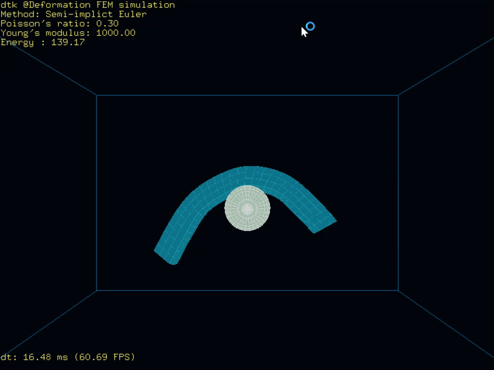

# (SimplePhysicsEngine) dtk

SimplePhysicsEngine, as its name suggests, is a simple(at least for now) physics engine developed based on deformable toolkit(dtk) which is used for deformable physical simulation. At first this repo is developed by dtk maintainer, and currently this repo is maintained by Simple-XX community.
- [(SimplePhysicsEngine) dtk](#simplephysicsengine-dtk)
  - [Project Structure](#project-structure)
  - [Dependencies](#dependencies)
    - [Boost](#boost)
    - [CGAL](#cgal)
    - [Eigen](#eigen)
    - [GLM](#glm)
    - [freeglut](#freeglut)
  - [VTK](#vtk)
  - [How to build](#how-to-build)
    - [Configure the Dependency Path](#configure-the-dependency-path)
    - [Build with CMake](#build-with-cmake)
      - [build with CMake GUI](#build-with-cmake-gui)
      - [build with CLI](#build-with-cli)
        - [build static libary](#build-static-libary)
        - [build dynamic library](#build-dynamic-library)
  - [Demo with dtk](#demo-with-dtk)
    - [Rigid body Simulation Demo](#rigid-body-simulation-demo)
    - [Finite Element Method Simulation](#finite-element-method-simulation)
    - [SPH Methods Simulation](#sph-methods-simulation)
    - [Guidewire Simulation](#guidewire-simulation)
    - [Finite Element Method Simulation in 3D](#finite-element-method-simulation-in-3d)
  - [Documentation](#documentation)

## Project Structure

```shell
.
|-- GUI
|   `-- opengl
|-- demo
|   |-- FEMsimulation
|   |-- RigidBodySimulation
|   |-- SPHSimulation
|   |-- guideWireSimulation
|   |   |-- Resources
|   |   |-- bak
|   |   `-- data
|   `-- img
|-- doc
|   `-- html
|       `-- search
|-- sim3D
|-- simulation
|   |-- include
|   `-- src
`-- src

```

This project is composed of several sub-projects, which can be built and compiled independently. The `/src` directory contains all the source and header files of dtk, which can be built and installed in your computer as developing dependency. In the `/demo`, there is 4 demos written based on dtk including FEM simulation, rigid body simulation, SPH simulation and guidewire simulation. `/simulation` is the general 2D simulation framework which integrates the FEM, polygon rigid body, and SPH simulation and `/sim3D` is the FEM simulation in 3D space.

## Dependencies

### [Boost](https://github.com/boostorg/boost)

Boost is a mandatory dependency of CGAL. Binary versions of Boost are available on SourceForge. The Boost installers install both Boost headers and precompiled libraries. Please note that the CGAL project is not responsible for the files provided on this website. When CGAL 5.2.1 was released, the latest version of Boost was 1.71. A typical installation of Boost would consist of the following steps:

Download and run the file boost_1_71_0-msvc-XX.Y-64.exe (where XX.Y = 14.0 for VC 2015, XX.Y = 14.1 for 2017, XX.Y = 14.2 for VC 2019).
Extract the files to a new directory, e.g. c:\dev\libboost_1_71_0.
Set the following two environment variables to point respectively to the path of the libraries and the headers

```bash
  BOOST_LIBRARYDIR = C:\dev\libboost_1_71_0\lib64-msvc-XX.Y
  BOOST_INCLUDEDIR = C:\dev\libboost_1_71_0
```

as this will help cmake to find Boost.
Add the path to the Boost dlls (C:\dev\libboost_1_71_0\lib64-msvc-XX.Y) files to the PATH environment variable.

### [CGAL](https://github.com/CGAL/cgal)

CGAL offers data structures and algorithms like triangulations, Voronoi diagrams, Polygons, Cell Complexes and Polyhedral, arrangements of curves, mesh generation, geometry processing, convex hull algorithms, to name just a few.

All these data structures and algorithms operate on geometric objects like points and segments, and perform geometric tests on them. These objects and predicates are regrouped in CGAL Kernels.

Finally, the Support Library offers geometric object generators and spatial sorting functions, as well as a matrix search framework and a solver for linear and quadratic programs. It further offers interfaces to third party software such as the GUI libraries Qt, Geomview, and the Boost Graph Library.

[How to install CGAL](https://doc.cgal.org/latest/Manual/index.html)

### [Eigen](https://eigen.tuxfamily.org/index.php?title=Main_Page)

Eigen is a C++ template library for linear algebra: matrices, vectors, numerical solvers, and related algorithms.

[How to build with Eigen](https://eigen.tuxfamily.org/dox/GettingStarted.html)

### [GLM](https://eigen.tuxfamily.org/index.php?title=Main_Page)

(GLM) is a header only C++ mathematics library for graphics software based on the OpenGL Shading Language (GLSL) specifications.

GLM provides classes and functions designed and implemented with the same naming conventions and functionality than GLSL so that anyone who knows GLSL, can use GLM as well in C++.

This project isn't limited to GLSL features. An extension system, based on the GLSL extension conventions, provides extended capabilities: matrix transformations, quaternions, data packing, random numbers, noise, etc...

This library works perfectly with OpenGL but it also ensures interoperability with other third party libraries and SDK. It is a good candidate for software rendering (raytracing / rasterization), image processing, physics simulations and any development context that requires a simple and convenient mathematics library.

[How to build with glm](https://github.com/Groovounet/glm)

### [freeglut](http://freeglut.sourceforge.net)

Freeglut, the Free OpenGL Utility Toolkit, is meant to be a free alternative to Mark Kilgard's GLUT library.

dtk Render by Opengl.

[How to build freeglut with CMAKE](https://doc.qt.io/qt-5/cmake-get-started.html#build-a-gui-executable)

## [VTK](https://vtk.org/)

[ The Visualization ToolKit (VTK)](https://vtk.org/Wiki/VTK) is an open source, freely available software system for 3D computer graphics, image processing, and visualization used by thousands of researchers and developers around the world. VTK consists of a C++ class library, and several interpreted interface layers including Tcl/Tk, Java, and Python. Professional support and products for VTK are provided by [Kitware, Inc.](http://www.kitware.com/) VTK supports a wide variety of visualization algorithms including scalar, vector, tensor, texture, and volumetric methods; and advanced modeling techniques such as implicit modelling, polygon reduction, mesh smoothing, cutting, contouring, and Delaunay triangulation. In addition, dozens of imaging algorithms have been directly integrated to allow the user to mix 2D imaging / 3D graphics algorithms and data.

## How to build

dtk is build by CMake. so you can build easily. You could build this project either in windows or linux. [tutorial on cmake build](https://preshing.com/20170511/how-to-build-a-cmake-based-project/)

### Configure the Dependency Path

To start with, what we need to do is to modify the **Dependency Path** in the CMakeLists.txt. For example, the CMakeLists.txt in sim3D configure the dependency path like this:

```cmake
if(WIN32)
    set(freeglut_include_dir D:\\Envs\\opengl\\freeglut-3.2.1\\include)
    set(freeglut_libraries_dir D:\\Envs\\opengl\\freeglut-3.2.1\\build\\lib)
    set(EIGEN_PATH D:\\Envs\\Eigen\\eigen-3.3.8)
    set(vtk_include_dir D:\\Envs\\VTK\\include\\vtk-8.2)
    set(vtk_libraries_dir D:\\Envs\\VTK\\lib)
```

before building this sub-project, make sure that you set the paths above according to your own develop environment.

### Build with CMake

#### build with CMake GUI
If you are a beginner to cpp with CMake, we advice you to use GUI command to build.  Actually , build with CLI is similar to build with CLI.

First, modify the CMakeLists.txt the correspondence library path.

Second, click the config button and wait. After configuration if there are some library have problems, you could set the path in the red hint in the GUI.

Finally, click the generate button, the project will generated and you could compile this by using Visual Studio.

#### build with CLI

##### build static libary
First，configure with command:

```bash
$ cmake -S "DTK_DIR" -B "DESTINATION_STATIC_DIR" -D CMAKE_INSTALL_PREFIX="PATH TO INSTALL STATIC LIBS" -G "Generates"
```

second, install with:

```bash
$ cmake --build "DESTINATION_STATIC_DIR" --config Release --target install
```

##### build dynamic library

First，configure with command:

```bash
$ cmake -S "DTK_DIR" -B "DESTINATION_SHARED_DIR" -D BUILD_SHARED_LIBS=ON -D CMAKE_INSTALL_PREFIX="PATH TO INSTALL SHARED LIBS" -G "Generates"
```

second, install with:

```bash
$ cmake --build "DESTINATION_SHARED_DIR" --config Release --target install
```

## Demo with dtk

### Rigid body Simulation Demo

 A physical simulation demo for 2D rigid body in real time. It deals with the collision of the rigid body which has no deformation by SAT and AABB methods.

<div align="center">
  
</div>

### Finite Element Method Simulation

A finite element method physical simulation for 2D hyperelasticity deformation meterial body in real time.

<div align="center">
  
</div>

### SPH Methods Simulation

A physical simulation demo for 2D fluid in real time. It deals with the fluid body by a series of SPH methods, which include WCSPH, PCISPH and DFSPH.

<div align = center>

</div>

The SPH method is WCSPH, PCISPH and DFSPH from left to right.

### Guidewire Simulation

A blood flow induced physical simulation of guidewire shape for virtual vascular intervention training system in real time. Virtual vascular intervention training system, which is a low cost, safe and effective solution, is able to provide an immersive virtual training environment for trainees.

<div align="center">
  
</div>
### Finite Element Method Simulation in 3D

<div align="center">
  
</div>

## Documentation

You can find documentation [here](https://github.com/Simple-XX/SimplePhysicsEngine/blob/main/doc/html/index.html).
